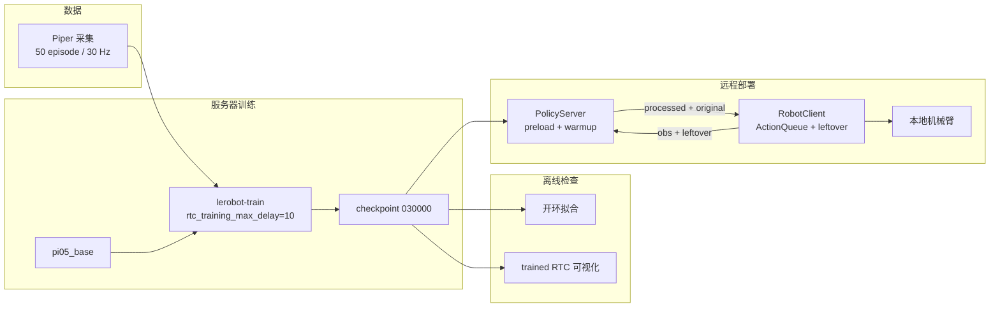
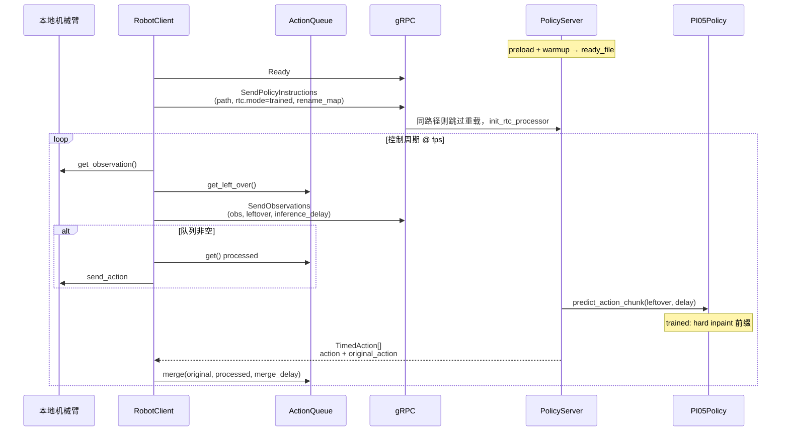

# 远程 Real-Time Chunking：从训练到部署的工作机制

本文说明一套完整管线：在 GPU 服务器上用 π₀.₅（Pi05）训练带 **trained RTC** 的策略，再通过 **异步推理（async inference）** 把观测与动作拆到本地机器人和远端策略服务上，并在 gRPC 上传递 RTC 所需的 leftover，使远程推理也能做块间衔接。

官方 LeRobot 里，RTC 原设计给本机 `lerobot-rollout`；async 的 `PolicyServer` 原先只做加权重叠。本文描述的是在此之上补齐 leftover 闭环后的机制。

---

## 1. 要解决的问题

π₀.₅ 一类 flow-matching 策略一次预测一整段未来动作（本实验 `chunk_size = 50`，约 1.7 s @ 30 Hz），而不是逐步输出单步。模型大，生成一段 chunk 所需时间往往超过机器人执行其中若干步的时间。若采用“算完再动”的同步推理，机械臂会在等待期间停住；若把相邻两段 chunk 直接拼接，后一段开头又常与前一段尚未执行的尾部不一致，交接处会出现停顿、抖动或策略突变。

因此需要同时满足两件事：

1. **异步执行**：机器人继续执行当前队列里的动作，同时策略在后台生成下一段。
2. **块间衔接（RTC）**：新 chunk 的前缀必须与上一 chunk 尚未执行的部分对齐，而不是在客户端对重叠区间做加权平均。

本实验把策略放在 GPU 服务器上，本地电脑只负责相机、关节与执行。官方 async 已经实现（1），但没有把 leftover 送到远端 `predict_action_chunk`，因此远程默认不是 RTC。补齐的是（2）在网络上的闭环。

---

## 2. 管线总览



四个阶段对应不同代码入口，彼此独立，但共享同一套 RTC 语义（前缀、delay、leftover）：

| 阶段 | 入口 | 是否走 leftover |
|------|------|-----------------|
| 训练 | `lerobot-train`，`PI05Policy.forward` | 训练时随机采样 clean prefix，无队列 |
| 离线 RTC 可视化 | `examples/rtc/eval_dataset.py` | 用数据集观测模拟 leftover |
| 开环拟合 | `examples/rtc/eval_openloop.py` | 否，每帧独立 teacher-forced |
| 远程部署 | `policy_server` + `robot_client` | 是，client 队列 ↔ gRPC ↔ `predict_action_chunk` |

本机训练产物：

- 基座：`/data1/hmcai/lerobot/downloads/pi05_base`
- 数据：`dataset/ming/piper-pick-cube_20260904_211137`（双臂 Piper，action/state 各 14 维，三路相机）
- checkpoint：`outputs/pi05_rtc/checkpoints/030000/pretrained_model`
- `rtc_training_max_delay = 10`，`chunk_size = 50`，checkpoint 内 `rtc_config = null`（训练不写入推理 RTC 配置；部署时由客户端 `--rtc.*` 注入）

---

## 3. 模型：π₀.₅ 与 flow matching

π₀.₅ 是视觉–语言–动作（VLA）策略：图像与语言经 PaliGemma / Gemma 编码，动作专家用 **flow matching** 从噪声积出一段动作。

采样循环在 `euler_integrate`（`src/lerobot/policies/common/flow_matching.py`）：时间从 $t=1$（纯噪声）走到 $t=0$（干净动作），每步

$$
x_{t+\Delta t} \leftarrow x_t + \Delta t \cdot v_\theta(x_t, t),\quad \Delta t = -1/N
$$

本实验 `num_inference_steps = 10`。RTC 不改网络结构，只改这段积分：要么在速度场上加 Jacobian 引导（guided），要么把前缀在全程钉死为上一 chunk 的 committed 动作（trained）。

策略对外接口是 `predict_action_chunk(batch, **kwargs)`。RTC 相关关键字为：

| 参数 | 含义 |
|------|------|
| `prev_chunk_left_over` | 上一 chunk **尚未执行**的 **模型空间（归一化）** 动作，形状 `(T, A)` 或 `(B, T, A)` |
| `inference_delay` | 本次推理期间机器人预计会走完的步数；trained 模式下等于硬前缀长度 |
| `execution_horizon` | guided 模式下重叠区终点；rollout 里也用来固定 leftover 张量长度 |

这三项必须由**执行侧**根据队列与实测延迟算出，再交给策略。本机 rollout 在同一进程里完成；远程部署则要把它们编码进观测，经 gRPC 送到服务器。

---

## 4. 训练时 RTC（action-prefix 条件化）

训练 **不** 打开 `RTCConfig`。是否学会 prefix 条件化，只看 `PI05Config.rtc_training_max_delay`。约束为 $0 \le d_{\max} < H$（$H$ 为 `chunk_size`）。本实验 $d_{\max}=10$。

`lerobot-train` 没有 RTC 专用分支；每步仍调用 `PI05Policy.forward`。RTC 完全在 policy 内实现，分三步。

### 4.1 采样前缀长度

每个样本独立采样 $d \sim \mathrm{Uniform}\{0,1,\ldots,d_{\max}\}$，得到布尔 mask：位置 $< d$ 为前缀。

```126:137:src/lerobot/policies/pi05/modeling_pi05.py
def _sample_training_rtc_prefix_mask(
    batch_size: int,
    action_horizon: int,
    max_delay: int,
    device: torch.device,
) -> Tensor | None:
    """Sample a clean action-prefix length independently for each training example."""
    if max_delay <= 0:
        return None
    delays = torch.randint(0, max_delay + 1, (batch_size,), device=device)
    positions = torch.arange(action_horizon, device=device)
    return positions.unsqueeze(0) < delays.unsqueeze(1)
```

### 4.2 前缀保持干净，后缀按时间插值

前缀位置：$x_t = a$（干净动作），条件时间 `model_time = 0`。  
后缀位置：标准 flow 插值 $x_t = t\cdot\varepsilon + (1-t)\cdot a$。

π₀.₅ 的时间嵌入支持 **按动作位置不同的** `(batch, horizon)` 时间张量，因此同一 chunk 内前缀与后缀可以处于不同噪声水平。

### 4.3 损失只在后缀上

`_reduce_training_rtc_loss` 对 `~prefix_mask` 求 MSE。前缀被当作“已经发生、不必再预测”的条件，而不是要拟合的目标。

训练语义与推理时 trained 模式对齐：模型必须在看到一段 `time=0` 的 committed 前缀后，把后缀 inpaint 出来。$d_{\max}$ 是推理时允许的最大 `inference_delay`；超过则 trained 路径会报错（远程服务器侧会先 clamp 再送入）。

---

## 5. 推理时两种 RTC

`RTCConfig.mode` 在部署时设置，与 checkpoint 是否写入 `rtc_config` 无关。

| | **guided**（默认） | **trained** |
|--|-------------------|-------------|
| 机制 | 每个 Euler 步对速度做 Jacobian 修正 | 硬 inpaint：前缀全程 clamp，对应位置 `time=0` |
| 额外计算 | 每步一次 `autograd.grad` | 无 backward |
| 适用 checkpoint | 任意 flow-matching（Pi0 / Pi05 / SmolVLA） | 仅 Pi05，且 `rtc_training_max_delay > 0` |
| 本实验应选 | 可用，但更慢 | **应选此项**（已按 $d_{\max}=10$ 训练） |

### 5.1 Guided：Jacobian 引导

`sample_actions` 在 `mode=="guided"` 时把 `rtc_enabled=True` 传给 `euler_integrate`，每步走 `RTCProcessor.denoise_step`：

1. leftover 右 pad 到与当前 $x_t$ 同形。
2. `get_prefix_weights(inference_delay, execution_horizon, T)` 得到重叠区权重（`LINEAR` / `EXP` / `ONES` / `ZEROS`）。
3. 由当前速度外推终点 $x_1$，与 leftover 的加权误差经 $\partial x_1 / \partial x_t$ 回传到速度，再减去 `guidance_weight * correction`。

首 chunk 无 leftover 时直接返回基础速度。guided **不要求** 训练时做过 prefix 条件化。

### 5.2 Trained：硬 inpaint

`mode=="trained"` 时 **不** 调用 `denoise_step`。`_prepare_trained_rtc_prefix` 把 leftover 的前 `inference_delay` 步写入 `hard_prefix`，并要求 `inference_delay ≤ rtc_training_max_delay`。`euler_integrate` 每步：

1. $x_t \leftarrow \mathrm{where}(\mathrm{mask}, \mathrm{hard\_prefix}, x_t)$
2. mask 位置的 per-action 时间置 `0.0`
3. 正常 `denoise_fn`
4. 再次 clamp 前缀

```106:131:src/lerobot/policies/common/flow_matching.py
        if hard_prefix is not None:
            ...
            x_t = torch.where(hard_prefix_mask, hard_prefix, x_t)
            time_tensor[hard_prefix_mask[..., 0]] = 0.0
        ...
        if hard_prefix is not None:
            x_t = torch.where(hard_prefix_mask, hard_prefix, x_t)
```

前缀在积分中始终是上一 chunk 的 committed 动作；模型只生成后缀。这与训练时 “clean prefix + 后缀 loss” 一致，所以推理不必再做 guidance。

### 5.3 与官方 async 加权重叠的区别

未开 RTC 时，`RobotClient` 用 `aggregate_fn`（默认 `weighted_average`：旧 0.3、新 0.7）在客户端混合重叠步。那是**输出空间的事后混合**，策略在生成新 chunk 时看不到上一 chunk。RTC 把 leftover 送进生成过程，衔接发生在 **inpaint / 引导** 里，而不是混合两条独立轨迹。

---

## 6. Leftover 与双延迟

执行侧用 `ActionQueue` 维护两条并行队列：

| 队列 | 内容 | 用途 |
|------|------|------|
| `original_queue` | 策略原始输出（归一化模型空间） | `get_left_over()` → 下次 `prev_chunk_left_over` |
| `queue` | postprocessor 之后、发给电机的动作 | `get()` → `robot.send_action` |

`get_left_over()` 返回 `original_queue[last_index:]`：尚未消费的 **original** 动作。必须用 original 而不是 processed：RTC 的 inpaint 发生在模型空间；若把反归一化后的关节角再当 leftover，尺度与策略训练分布不一致。

`merge(original, processed, real_delay)` 在 RTC 开启时是 **整队列替换**：丢掉新 chunk 的前 `real_delay` 步（推理期间机器人已经执行过），从第 `real_delay` 步起入队，并把 `last_index` 置 0。

存在两个不要混用的 delay：

| 名称 | 何时计算 | 含义 |
|------|----------|------|
| `inference_delay` | **发观测之前** | 计划用于 prefix 条件化的步数。远程 client 用 `LatencyTracker.max()`（历史最大往返）换算；无 leftover 时为 0 |
| `merge_delay` / `real_delay` | **收到新 chunk 之后** | 本次实测耗时换算的步数，决定丢掉新 chunk 前多少步 |

本地 `lerobot-rollout` 还有更严的校验：若实测 delay 大于条件化时用的 delay，或超过 `rtc_training_max_delay`，会丢弃该 chunk 并重试。远程 client 目前用 clamp + `merge_delay` 对齐，而不是丢弃重试。

首 chunk 特判：若推理期间还没有消费任何动作（`consumed == 0`），`merge_delay` 强制为 0，避免把新 chunk 前缀整段丢掉造成启动抖动。

论文约束（trained 部署）：$d \le s \le H - d$，其中 $s$ 为 `execution_horizon`。本实验 $d=10$、$H=50$，故 `execution_horizon` 应落在 $[10, 40]$。客户端示例常用 `20`。

---

## 7. 通信层：gRPC 与 pickle

传输协议未改。`src/lerobot/transport/services.proto` 的 `AsyncInference` 仍是四个 RPC：

```
Ready(Empty) → Empty
SendPolicyInstructions(PolicySetup) → Empty
SendObservations(stream Observation) → Empty
GetActions(Empty) → Actions
```

`Observation` / `Actions` / `PolicySetup` 的 payload 都是 `bytes`。RTC 字段没有独立 proto：`TimedObservation` 与 `TimedAction` 用 pickle 序列化后塞进 `data`。因此 leftover 张量随观测一起走，`original_action` 随动作列表回来。

两端必须使用同一套 patched 代码（含 `TimedObservation.inference_delay` / `prev_chunk_left_over` 与 `TimedAction.original_action`）。旧 server 会忽略未知字段或在 unpickle 时失败，不能把 leftover 送进策略。

网络拓扑：GPU 服务器多在内网。笔记本侧常用 SSH 隧道把本地 `8080` 转到服务器 `127.0.0.1:8080`。服务器监听 `127.0.0.1`，客户端连 `127.0.0.1:8080`。同一局域网且防火墙放行时，才改为 `--host=0.0.0.0`。

---

## 8. 服务端生命周期

### 8.1 启动：预加载与 dummy 推理

未改之前，`PolicyServer` 启动时是空的，等客户端 `SendPolicyInstructions` 再加载约 14 GB 的 π₀.₅。首次 `GetActions` 还会碰上 CUDA kernel 编译，延迟很大。

现在若传入 `--pretrained_path`，`serve()` 在 `server.start()` **之前**同步执行 `preload()`：

1. `_infer_policy_type`：读 checkpoint `config.json` 的 `"type"`（本实验为 `pi05`）。
2. `_load_policy`：`from_pretrained` + `.to(device)`。
3. `_apply_runtime_overrides`：建 preprocessor / postprocessor。此时还没有客户端的 `rtc_config` / `rename_map`。
4. `warmup()`：按 `input_features` 造全零观测，跑一次 `predict_action_chunk`（无 RTC kwargs）再 postprocess。失败则进程退出，端口不会打开。
5. `mark_ready()`：置 `_model_ready=True`，写 `ready_file`（默认 `logs/policy_server.ready`）。进程退出时删除该文件。

`Ready` RPC：若走了 preload 且尚未 warmup 完，返回 `UNAVAILABLE`。无 preload 时保持旧行为，不检查 `_model_ready`。

### 8.2 握手：运行时覆盖，尽量不重载权重

客户端连接后：

1. `Ready`：清空观测队列。
2. `SendPolicyInstructions`：pickle 传入 `RemotePolicyConfig`（含 `pretrained_name_or_path`、`policy_type`、`device`、`actions_per_chunk`、`rename_map`、`rtc_config`）。

若客户端路径与 `_preloaded_path` 解析后相同，**跳过权重重载**，只再跑 `_apply_runtime_overrides`：重建 processor（注入 `rename_map`），并在 `rtc_config.enabled` 时调用 `policy.init_rtc_processor()`。路径不同则重新 `_load_policy`。

因此：权重可以在开端口前加载；RTC 模式与相机键映射仍由客户端握手注入。客户端 `--pretrained_name_or_path` 必须是 **服务器上的绝对路径**，与 `--pretrained_path` 一致，否则会再加载一遍。

### 8.3 推理：`GetActions`

前置：policy 未加载 → `FAILED_PRECONDITION`；preload 未 ready → 同样拒绝。

从 `observation_queue` 取最新 `TimedObservation`，经 preprocessor 后：

1. `_prepare_rtc_kwargs`：取出 `inference_delay`、`prev_chunk_left_over`、`execution_horizon`；trained 模式下若 delay 超过 `rtc_training_max_delay` 则 clamp。
2. `policy.predict_action_chunk(obs, **rtc_kwargs)`。
3. 在 postprocessor **之前**把整段 chunk 存为 `original_actions`。
4. 逐步 postprocess（反归一化）得到机器人空间动作。
5. `_time_action_chunk` 写成 `TimedAction` 列表：`action` = processed，`original_action` = 模型空间。RTC 关闭时 `original_action=None`。

---

## 9. 客户端控制环

`RobotClient` 三个并发角色：

1. **控制线程**（`control_loop`，按 `fps`）：读相机/关节、在队列将空时发观测、从队列取一步发给机器人。
2. **接收线程**（`receive_actions`）：轮询 `GetActions`，把 chunk merge 进队列。
3. **发送**：`SendObservations` 流式把 pickle 后的 `TimedObservation` 推到服务器。

RTC 开启时用 `ActionQueue` + `LatencyTracker`，不用普通 `Queue` + `weighted_average`。

### 9.1 何时发下一次观测

`_ready_to_send_observation`：

- `_rtc_inflight` 为真（上一请求尚未返回）→ 不发，保证 leftover 与 in-flight 请求一一对应。
- 否则当 `qsize / actions_per_chunk ≤ chunk_size_threshold`（默认 0.5）时发送。即队列剩约一半时开始算下一段，用执行缓冲覆盖推理+网络往返。

`must_go`：队列空且需要立刻补动作时强制放行。

### 9.2 构造 leftover

发观测时：

```
leftover = rtc_queue.get_left_over()
inference_delay = 0  if leftover is None
                 else ceil(LatencyTracker.max() / environment_dt)
execution_horizon = config.rtc.execution_horizon
```

并记录 `_rtc_index_before`、`_rtc_request_start`，置 `_rtc_inflight=True`。发送失败则清掉 inflight。

### 9.3 收到 chunk 后 merge

```
measured_delay = ceil((now - request_start) / environment_dt)
consumed = rtc_queue.get_action_index() - index_before
merge_delay = 0 if consumed == 0 else measured_delay
rtc_queue.merge(original, processed, merge_delay, index_before)
latency_tracker.add(elapsed)
```

`original` 来自 `TimedAction.get_original_action()`，供下一次 leftover；`processed` 供电机。

### 9.4 执行一步

`control_loop_action` 从 `rtc_queue.get()` 取 **processed** 动作，写成机器人 dict 后 `robot.send_action`。`last_index` 前进，下一次 leftover 自动变短。

---

## 10. 端到端时序



一次请求里，机器人在等待期间仍按队列执行。新 chunk 回来后，前 `merge_delay` 步被丢弃（对应这段等待），剩余步替换队列。下一次观测携带新的 leftover，形成闭环。

---

## 11. 职责划分

| 仍由客户端完成 | 现由服务器完成 |
|----------------|----------------|
| 机器人 I/O、相机、fps 控制环 | 权重加载、CUDA warmup、ready 标记 |
| `ActionQueue` 消费与 `get_left_over()` | 同 checkpoint 免重载 |
| 用 `LatencyTracker` 估计 `inference_delay` | 握手时注入 RTC processor |
| 发送时机（threshold / inflight / must_go） | `predict_action_chunk(**rtc_kwargs)` |
| 首 chunk `merge_delay=0` | 分离 original / processed 并回传 |
| `rename_map`、任务字符串 | trained 模式下 clamp `inference_delay` |

向后兼容：`--rtc.enabled` 默认 `false`，行为与官方 async 相同（`weighted_average`）。`--pretrained_path` 为空则不预加载，仍等握手再加载。RTC 需要两端都打过补丁；server 在 `supports_rtc()` 失败时握手报错，不会静默降级。

---

## 12. 本实验配置要点

| 项 | 取值 | 说明 |
|----|------|------|
| 策略 | `pi05` | 唯一同时支持训练 RTC 与 trained 推理的策略 |
| `rtc_training_max_delay` | 10 | 训练采样前缀上限，也是推理 delay 上限 |
| `chunk_size` / `actions_per_chunk` | 50 | 与基座一致 |
| `rtc.mode` | `trained` | 与 checkpoint 对齐；不要用 guided 除非要对比 |
| `execution_horizon` | 建议 10–40，常用 20 | 须满足 $d \le s \le H-d$ |
| `chunk_size_threshold` | 0.5 | 队列剩一半时发下一段 |
| 相机键 | 策略侧 `base_0_rgb` / `left_wrist_0_rgb` / `right_wrist_0_rgb` | 采集侧名称不同时用 `rename_map` |
| 任务 | `Pick up the cube and put it in the pen holder` | 与 `tasks.parquet` 一致 |
| checkpoint | `.../030000/pretrained_model` | 客户端路径必须等于服务器绝对路径 |

离线检查（不经过 gRPC）：

- `examples/rtc/eval_dataset.py`：同一观测分别跑 RTC / 非 RTC，画块间衔接。
- `examples/rtc/eval_openloop.py`：用数据集观测预测 chunk，与 ground-truth 比 MAE（不使用 leftover）。

---

## 13. 关键代码索引

| 模块 | 路径 |
|------|------|
| 训练 prefix / trained prefix | `src/lerobot/policies/pi05/modeling_pi05.py` |
| Euler + hard_prefix / guidance hook | `src/lerobot/policies/common/flow_matching.py` |
| `RTCConfig` / `RTCProcessor` | `src/lerobot/policies/rtc/configuration_rtc.py`, `modeling_rtc.py` |
| `ActionQueue` / `LatencyTracker` | `src/lerobot/policies/rtc/action_queue.py`, `latency_tracker.py` |
| 本机 rollout RTC 环 | `src/lerobot/rollout/inference/rtc.py` |
| 远程配置 | `src/lerobot/async_inference/configs.py` |
| 传输类型 | `src/lerobot/async_inference/helpers.py` |
| 服务端 | `src/lerobot/async_inference/policy_server.py` |
| 客户端 | `src/lerobot/async_inference/robot_client.py` |
| Proto | `src/lerobot/transport/services.proto` |
| 官方 RTC / async 文档 | `docs/source/rtc.mdx`, `docs/source/async.mdx` |

---

## 14. 小结

RTC 把“下一段动作必须接上正在执行的那一段”写成 flow matching 的条件生成问题。训练阶段用随机 clean prefix 教会 π₀.₅ 在 `time=0` 条件下 inpaint 后缀；推理阶段 trained 模式把 leftover 硬钉在前缀上，不再做 Jacobian 引导。

远程部署把同一套 leftover 语义拆开：客户端维护队列、估计 delay、执行 processed 动作；服务器只负责用 leftover 调用 `predict_action_chunk`，并同时返回模型空间 original 与机器人空间 processed。gRPC 仍传输 pickle 字节；预加载与 dummy 推理只解决“开端口时模型已经能跑”，不改变握手与控制环。

闭环可以记成一句话：**队列里还没执行的 original 动作，经观测发到服务器，成为下一段 chunk 的前缀；新 chunk 的 original 再写回队列，processed 交给机械臂。**
